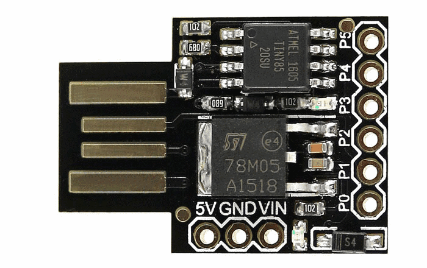
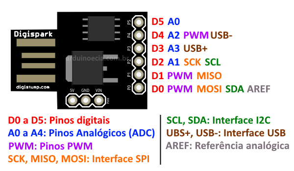
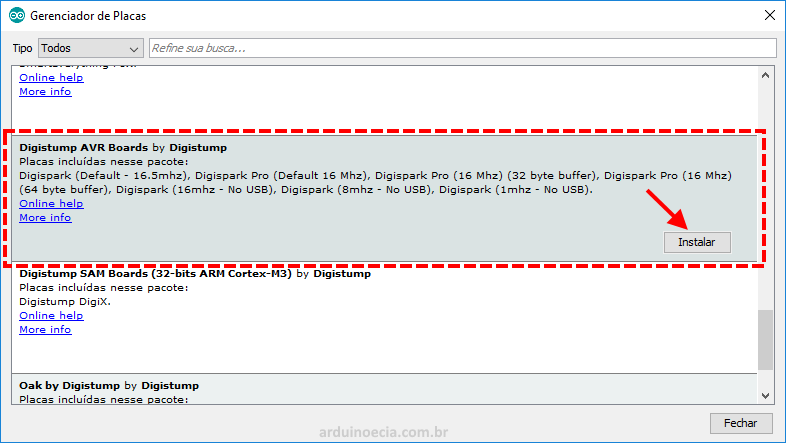
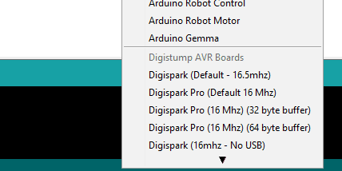

# Digispark ATtiny85

- Microcontrolador ATmel ATtiny85 [datasheet](Atmel-2586-AVR-8-bit-Microcontroller-ATtiny25-ATtiny45-ATtiny85_Datasheet.pdf)
- Alimentação USB 5V ou externa (7 à 35V)
- Regulador de tensão onboard.
- Conexão USB
- 6 pinos de I/O
- Memória flash 8KB
- Interfaces I2C e SPI
- 3 pinos podem ser utilizados como PWM
- Conversor analógico digital em 4 pinos
- Leds onboard

## URL para Gerenciador de Placas:
 
 [http://digistump.com/package_digistump_index.json](http://digistump.com/package_digistump_index.json)
 
## Pinout
 

## Setup

Instalar via **Boards Manager**:

Escolher `Digispark (Default 16.5mhz)`

