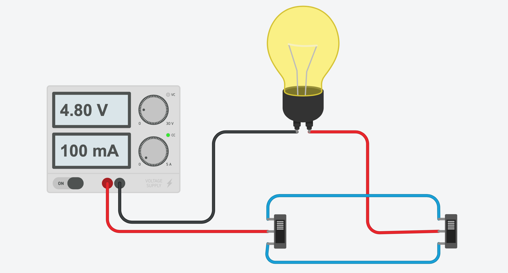

# Lâmpada com 2 interruptores

Como ligar/desligar uma lâmpada usando 2 interruptores em locais diferentes.

> Exemplo de aplicação 1: um na base da escada e outro no topo
> Exemplo de aplicação 2: um na entrada da casa e outro na outra ponta
> Exemplo de aplicação 3: acender a luz no quarto e apagar na cabeceira da cama

## Simulação no TinkerCad:
 
 [https://www.tinkercad.com/things/4oyDGPizre1-lampada-com-2-interruptores](https://www.tinkercad.com/things/4oyDGPizre1-lampada-com-2-interruptores)
 
## circuito
 

